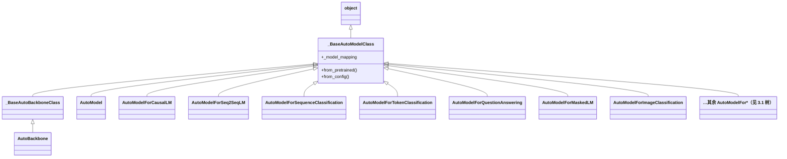

# `_BaseAutoModelClass` 与 AutoModel 家族（第 2 周）

> 初学者向说明。对应你项目里常见的：  
> `AutoTokenizer` / `AutoModelForCausalLM.from_pretrained(...)`  
> 本文只讲 **模型 Auto 类**；Tokenizer 的 Auto 是另一套工厂，不要混为一谈。

<a id="auto-1"></a>
## 1. `_BaseAutoModelClass` 是什么？

路径：`transformers.models.auto.auto_factory._BaseAutoModelClass`

可以把它理解成：

> **「按任务自动选具体模型类」的工厂基类。**

它本身：

- **不能**直接 ` _BaseAutoModelClass()` 实例化（会报错）
- **不包含**某一家模型（Llama / BERT / ViT，见 [§1.1](#auto-1-1)）的具体网络结构
- 提供统一入口：`from_pretrained` / `from_config`
- 真正干活时：读 `config.json` 的 `model_type` → 查自己的 `_model_mapping` → 返回对应具体类实例（如 `LlamaForCausalLM`）

和你项目的关系：

```python
from transformers import AutoModelForCausalLM

# 你写的是 Auto*
model = AutoModelForCausalLM.from_pretrained(".../SmolLM2-135M-Instruct")

# 实际拿到的往往是具体类，例如：
# LlamaForCausalLM（SmolLM2 走 Llama 架构）
```

所以：

| 你看到的名字 | 实际角色 |
|---|---|
| `_BaseAutoModelClass` | Auto 模型家族的**公共基类 / 工厂模板** |
| `AutoModelForCausalLM` | 面向「因果语言模型」任务的 Auto 入口 |
| `LlamaForCausalLM` | 真正的网络类（权重结构在这里） |

<a id="auto-1-1"></a>
### 1.1 Llama / BERT / ViT：是不同网络结构类型吗？

**是。** 它们属于不同的**模型架构家族**（`config.json` 里的 `model_type`），不是同一套网络换个名字。

可以记成两层：

| 层 | 例子 | 回答的问题 |
|---|---|---|
| **架构家族**（网络骨架怎么搭） | Llama、BERT、ViT | 有几块、注意力怎么看上下文、输入是文本还是图像 |
| **任务头 / Auto 入口**（输出干什么） | `ForCausalLM`、`ForSequenceClassification` | 生成下一个词？分类？检测？ |

同一架构可以挂不同任务头；同一任务头也可以映射到不同架构。例如：

- `Llama` + `ForCausalLM` → 聊天生成（本项目）  
- `BERT` + `ForSequenceClassification` → 情感分类  
- `ViT` + `ForImageClassification` → 图像分类  

#### 三者含义与作用

| 名称 | 全称 / 来源 | 结构类型 | 输入 | 主要作用 | 典型 Auto 入口 |
|---|---|---|---|---|---|
| **Llama** | Large Language Model Meta AI（Meta 开源 LLM 家族） | **Decoder-only**（从左到右因果注意力） | 文本 token | 续写、聊天、指令跟随、SFT | `AutoModelForCausalLM` |
| **BERT** | Bidirectional Encoder Representations from Transformers | **Encoder-only**（双向看全文） | 文本 token | 理解与表示：分类、NER、抽取式 QA | `AutoModelForMaskedLM` / `ForSequenceClassification` 等 |
| **ViT** | Vision Transformer | **Encoder-only**（把图像切成 patch 当“词”） | 图像 patch | 图像分类、视觉特征；常作多模态视觉塔 | `AutoModelForImageClassification` 等 |

一句话对比：

```text
Llama：擅长「往后写」——下一个 token 是什么
BERT ：擅长「读懂」——这句话/这段落是什么意思
ViT  ：擅长「看图」——这张图属于哪一类 / 图像特征是什么
```

和本仓库的对应：

- 你本地 `models/SmolLM2-135M/config.json` 里是 `"model_type": "llama"`、`"architectures": ["LlamaForCausalLM"]`  
- 所以 SmolLM2 **不是 BERT，也不是 ViT**；它走 **Llama 系 Decoder-only** 骨架，再配因果语言模型头做生成。

更细的 Encoder / Decoder 对比，可回看：[Encoder-Decoder与LLM问答流程.md](./Encoder-Decoder与LLM问答流程.md)（尤其 BERT / BART / SmolLM）。

<a id="auto-2"></a>
## 2. 它解决什么问题？

没有 Auto 时，你必须自己写：

```python
from transformers import LlamaForCausalLM
model = LlamaForCausalLM.from_pretrained(path)
```

换一个 BERT 分类模型又要改 import。  
有了 Auto：

```python
from transformers import AutoModelForCausalLM, AutoModelForSequenceClassification

lm = AutoModelForCausalLM.from_pretrained(llm_path)          # 聊天/续写
clf = AutoModelForSequenceClassification.from_pretrained(bert_path)  # 分类
```

**同一个调用习惯，不同任务换不同 Auto 子类。**

加载大致流程：

```text
from_pretrained(路径或模型名)
    → 读取 config.json（model_type / architectures）
    → 在本 Auto 类的 _model_mapping 里查找
    → 选出具体模型类（如 LlamaForCausalLM）
    → 创建该类并加载权重
    → 返回「具体模型实例」（类型已不是 Auto*）
```

<a id="auto-3"></a>
## 3. 继承结构关系（先看总图）

> 读图要点：左右是「谁继承谁」；叶子之间**没有**父子关系。  
> 本机 `transformers` 里，这些 Auto 模型类约 45 个，几乎全部是 `_BaseAutoModelClass` 的**直接子类**。

### 3.1 类继承结构树形图（完整）

下面这棵树就是「类的继承结构」。缩进表示父子；同级并列表示互不继承。

```text
object
└── _BaseAutoModelClass                    ← 工厂基类（不能直接 new）
    │
    ├── 【骨干 / 表征】
    │   ├── AutoModel
    │   └── AutoModelForTextEncoding
    │
    ├── 【文本生成 / 语言建模】              ← 本项目主线在这一支
    │   ├── AutoModelForCausalLM           ★ 聊天 / 续写 / SFT
    │   ├── AutoModelForSeq2SeqLM
    │   ├── AutoModelForMaskedLM
    │   ├── AutoModelWithLMHead            （旧接口，兼容）
    │   └── _AutoModelWithLMHead           （内部）
    │
    ├── 【文本理解 / 分类标注】
    │   ├── AutoModelForSequenceClassification
    │   ├── AutoModelForTokenClassification
    │   ├── AutoModelForQuestionAnswering
    │   ├── AutoModelForMultipleChoice
    │   ├── AutoModelForNextSentencePrediction
    │   ├── AutoModelForTableQuestionAnswering
    │   ├── AutoModelForDocumentQuestionAnswering
    │   └── AutoModelForPreTraining
    │
    ├── 【语音 / 音频】
    │   ├── AutoModelForAudioClassification
    │   ├── AutoModelForAudioFrameClassification
    │   ├── AutoModelForAudioXVector
    │   ├── AutoModelForAudioTokenization
    │   ├── AutoModelForCTC
    │   ├── AutoModelForSpeechSeq2Seq
    │   ├── AutoModelForTextToSpectrogram
    │   └── AutoModelForTextToWaveform
    │
    ├── 【视觉】
    │   ├── AutoModelForImageClassification
    │   ├── AutoModelForZeroShotImageClassification
    │   ├── AutoModelForImageSegmentation
    │   ├── AutoModelForSemanticSegmentation
    │   ├── AutoModelForInstanceSegmentation
    │   ├── AutoModelForUniversalSegmentation
    │   ├── AutoModelForObjectDetection
    │   ├── AutoModelForZeroShotObjectDetection
    │   ├── AutoModelForDepthEstimation
    │   ├── AutoModelForMaskedImageModeling
    │   ├── AutoModelForImageToImage
    │   ├── AutoModelForKeypointDetection
    │   ├── AutoModelForKeypointMatching
    │   ├── AutoModelForMaskGeneration
    │   └── AutoModelForVideoClassification
    │
    ├── 【多模态 / 视觉-语言】
    │   ├── AutoModelForImageTextToText
    │   ├── AutoModelForVision2Seq
    │   ├── _AutoModelForVision2Seq        （内部）
    │   └── AutoModelForVisualQuestionAnswering
    │
    ├── 【其它】
    │   └── AutoModelForTimeSeriesPrediction
    │
    └── 【Backbone 支线】（多一层基类）
        └── _BaseAutoBackboneClass
            └── AutoBackbone
```

### 3.2 精简版（只记主干）

```text
object
 └── _BaseAutoModelClass
      ├── AutoModel
      ├── AutoModelForCausalLM     ← 本项目最常用
      ├── AutoModelForSeq2SeqLM
      ├── AutoModelForMaskedLM
      ├── AutoModelForSequenceClassification
      ├── AutoModelForTokenClassification
      ├── AutoModelForQuestionAnswering
      ├── AutoModelFor*（图像 / 音频 / 多模态等，见上树）
      └── _BaseAutoBackboneClass
           └── AutoBackbone
```

### 3.3 Mermaid 类图（与上树等价，便于 HTML 渲染）



注意：

1. **继承很“平”**：绝大多数 `AutoModelFor*` 都**直接**继承 `_BaseAutoModelClass`，彼此不是父子。树里的「【分组】」只是阅读分组，不是类。  
2. 区别主要在各自的 **`_model_mapping`（任务映射表）**，不是深层继承树。  
3. `AutoTokenizer` / `AutoConfig` / `AutoProcessor` **不是** `_BaseAutoModelClass` 的子类（不在这棵树上）。

### 3.4 运行时「二次分派」示意（工厂 → 具体网络）

这不是继承树，而是一次 `from_pretrained` 的调用链：

```text
AutoModelForCausalLM.from_pretrained(path)
        │
        ▼
 _BaseAutoModelClass.from_pretrained（基类逻辑）
        │
        ▼
 查 MODEL_FOR_CAUSAL_LM_MAPPING
        │
        ▼
 得到 LlamaForCausalLM（举例）
        │
        ▼
 LlamaForCausalLM.from_pretrained / 加载权重
```

<a id="auto-4"></a>
## 4. 子类怎么理解？（按任务分组）

你环境中 PyTorch Auto 模型类大约 40+ 个。不必背全，先按**任务**记。

### 4.1 文本生成 / 语言建模（和本项目最相关）

| 类名 | 含义（干什么） | 典型用途 |
|---|---|---|
| `AutoModel` | 骨干网络（常只有 Transformer 主体，不一定带任务头） | 取隐状态、做特征 |
| `AutoModelForCausalLM` | **因果语言模型**（从左到右预测下一个 token） | 聊天、续写、SFT（本项目） |
| `AutoModelForSeq2SeqLM` | 编码器-解码器生成 | 翻译、摘要（T5/BART） |
| `AutoModelForMaskedLM` | 掩码语言模型 | BERT 填空式预训练/补全 |
| `AutoModelWithLMHead` | 旧接口，带 LM 头的通用生成（已不推荐，兼容用） | 历史代码 |
| `_AutoModelWithLMHead` | 内部/兼容实现 | 一般别直接用 |

### 4.2 文本理解 / 分类标注

| 类名 | 含义 | 典型用途 |
|---|---|---|
| `AutoModelForSequenceClassification` | 整句/整段分类 | 情感分析、意图分类 |
| `AutoModelForTokenClassification` | 每个 token 分类 | NER、词性 |
| `AutoModelForQuestionAnswering` | 抽取式问答（答案是原文跨度） | SQuAD 类 |
| `AutoModelForMultipleChoice` | 多选 | 阅读理解选择题 |
| `AutoModelForNextSentencePrediction` | 下一句预测 | BERT NSP |
| `AutoModelForTableQuestionAnswering` | 表格问答 | Tapas 等 |
| `AutoModelForDocumentQuestionAnswering` | 文档问答（常含版面/图像） | DocVQA |
| `AutoModelForTextEncoding` | 文本编码表示 | 取句向量/表征 |

### 4.3 语音 / 音频

| 类名 | 含义 |
|---|---|
| `AutoModelForAudioClassification` | 音频分类 |
| `AutoModelForAudioFrameClassification` | 音频帧级分类 |
| `AutoModelForAudioXVector` | 说话人/声纹类表示 |
| `AutoModelForAudioTokenization` | 音频离散化/tokenization 相关 |
| `AutoModelForCTC` | CTC 语音识别 |
| `AutoModelForSpeechSeq2Seq` | 语音序列到序列（如 Whisper） |
| `AutoModelForTextToSpectrogram` | 文本 → 频谱 |
| `AutoModelForTextToWaveform` | 文本 → 波形 |

### 4.4 视觉

| 类名 | 含义 |
|---|---|
| `AutoModelForImageClassification` | 图像分类 |
| `AutoModelForZeroShotImageClassification` | 零样本图像分类 |
| `AutoModelForImageSegmentation` | 图像分割 |
| `AutoModelForSemanticSegmentation` | 语义分割 |
| `AutoModelForInstanceSegmentation` | 实例分割 |
| `AutoModelForUniversalSegmentation` | 更统一的分割接口 |
| `AutoModelForObjectDetection` | 目标检测 |
| `AutoModelForZeroShotObjectDetection` | 零样本检测 |
| `AutoModelForDepthEstimation` | 深度估计 |
| `AutoModelForMaskedImageModeling` | 掩码图像建模 |
| `AutoModelForImageToImage` | 图像到图像 |
| `AutoModelForKeypointDetection` | 关键点检测 |
| `AutoModelForKeypointMatching` | 关键点匹配 |
| `AutoModelForMaskGeneration` | 掩码生成（如 SAM 相关） |
| `AutoModelForVideoClassification` | 视频分类 |

### 4.5 多模态 / 视觉-语言

| 类名 | 含义 |
|---|---|
| `AutoModelForImageTextToText` | 图文输入 → 文本输出 |
| `AutoModelForVision2Seq` | 视觉到文本序列 |
| `_AutoModelForVision2Seq` | 内部/兼容版本 |
| `AutoModelForVisualQuestionAnswering` | 视觉问答 |

### 4.6 其它

| 类名 | 含义 |
|---|---|
| `AutoModelForPreTraining` | 对应模型的预训练头组合 |
| `AutoModelForTimeSeriesPrediction` | 时间序列预测 |
| `_BaseAutoBackboneClass` | Backbone 专用基类（也继承自 `_BaseAutoModelClass`） |
| `AutoBackbone` | 视觉骨干网络 Auto 入口 |

<a id="auto-5"></a>
## 5. 和你当前项目怎么对上号？

本仓库问答 / SFT 主线：

```python
AutoTokenizer.from_pretrained(...)           # 不是 _BaseAutoModelClass 子类
AutoModelForCausalLM.from_pretrained(...)    # 是 _BaseAutoModelClass 子类
```

为什么是 `ForCausalLM` 而不是 `AutoModel`？

- `AutoModel`：多拿 backbone 隐状态  
- `AutoModelForCausalLM`：带 **语言模型头（lm_head）**，能算 next-token logits，才能 `generate` / 算生成 loss  

第 2 周脚本里加载 135M/360M，本质上都是：

> 用 Auto 入口按 `config.json` 自动选到具体 Causal LM 类，再 `.to(device)`。

<a id="auto-6"></a>
## 6. 初学者易混点

1. **`AutoModelForCausalLM` 不是最终网络类型**  
   `type(model)` 打印出来通常是 `LlamaForCausalLM` 等具体类。

2. **Auto 子类之间几乎不互相继承**  
   `ForCausalLM` 不是 `AutoModel` 的子类；它们是「同级工厂」，各管一张映射表。

3. **选错 Auto 类会加载失败或头不对**  
   把生成模型当成 `ForSequenceClassification` 去加载，往往会报映射/结构不匹配。

4. **名字里的 ForXxx = 任务头**  
   记住：Auto 负责“自动选哪家模型”，`ForXxx` 负责“要哪种任务输出头”。

5. **下划线开头的类**  
   `_BaseAutoModelClass`、`_AutoModelWithLMHead` 偏内部 API；业务代码优先用公开的 `AutoModelFor*`。

<a id="auto-7"></a>
## 7. 最小实验（建议和第 2 周 Day 2 一起做）

在已激活的 venv 里：

```python
from transformers import AutoConfig, AutoModelForCausalLM

path = "models/SmolLM2-135M-Instruct"  # 按你本地目录
cfg = AutoConfig.from_pretrained(path, local_files_only=True)
model = AutoModelForCausalLM.from_pretrained(path, local_files_only=True)

print("config.model_type =", cfg.model_type)
print("Auto 入口类     =", "AutoModelForCausalLM")
print("实际模型类     =", type(model).__name__)
print("是否 CausalLM 子类家族 =", model.__class__.__name__.endswith("ForCausalLM") or "ForCausalLM" in type(model).__name__)
```

你应看到类似：

- `model_type` 与 SmolLM/Llama 配置一致  
- `type(model).__name__` 是具体类，不是 `AutoModelForCausalLM`

<a id="auto-8"></a>
## 8. 速记卡片

- `_BaseAutoModelClass` = Auto 模型工厂的基类  
- 子类 = 不同任务的 Auto 入口（主要靠 `_model_mapping` 区分）  
- Llama / BERT / ViT = 不同**架构家族**（骨架）；`ForXxx` = 不同**任务头**  
- 本项目主用：`AutoModelForCausalLM`（架构是 Llama 系）  
- 真正计算的是映射后的具体类（如 `LlamaForCausalLM`）  
- `AutoTokenizer` 不在这棵继承树上  

---

## 和本周其它材料的关系

- 设备与搬模型：`learn/week02/02_move_to_device.py`（里面会用到 Causal LM 加载）  
- 试更大模型：`learn/week02/06_try_360m.py`（仍然是同一 Auto 入口）  
- 学习计划入口：[第 2 周](../学习计划.md#week2)
